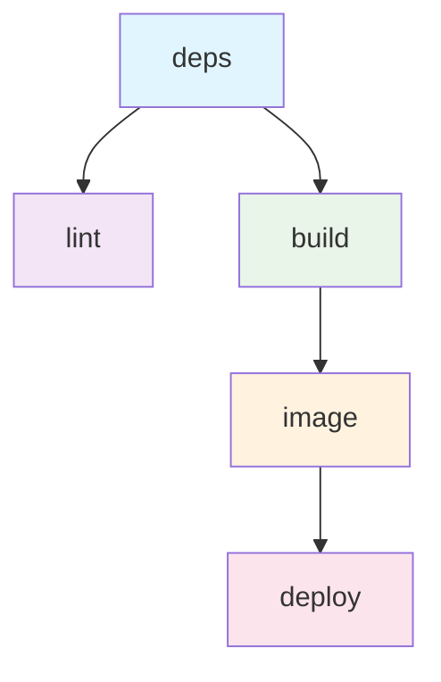

# CI/CD Pipeline Documentation

This document describes the modular CI/CD pipeline for the DyingStar Website project.

## 📋 Overview

The CI/CD pipeline is split into multiple specialized workflows that work together to provide efficient development feedback and automated deployments.

### Pipeline Architecture



## 🚀 Workflows

### 1. **Main Orchestrator** (`cicd.yml`)

**Purpose**: Coordinates all CI/CD workflows based on trigger events

**Triggers**:
- 🔀 Pull requests to `main` or `develop`
- 📤 Push to `main` or `develop` branches
- 🏷️ Version tags (`v*`, `release-*`)
- 🎯 Manual dispatch (`workflow_dispatch`)

**Execution Logic**:
- **Pull Requests**: `deps` → (`lint` + `build`) in parallel
- **Main/Develop/Tags**: `deps` → (`lint` + `build`) → `image` → `deploy`

### 2. **Dependencies** (`deps.yml`)

**Purpose**: Install and cache project dependencies

**Features**:
- 📦 pnpm installation with version detection from `package.json`
- 🗄️ Caches `node_modules` and pnpm store
- 🔧 Configures build scripts allowlist
- 📤 Outputs pnpm version for consistency

**Cache Strategy**:
```yaml
Key: node-modules-${{ runner.os }}-${{ hashFiles('pnpm-lock.yaml') }}
Paths:
  - node_modules
  - ~/.local/share/pnpm
```

### 3. **Linting** (`lint.yml`)

**Purpose**: Code quality and type checking

**Dependencies**: Requires `deps` workflow completion

**Steps**:
1. Restore cached dependencies
2. Generate TypeScript types (`pnpm type:generate`)
3. Run linting and type checking (`pnpm lint:ci`)

### 4. **Build** (`build.yml`)

**Purpose**: Build Next.js application and create deployment artifacts

**Dependencies**: Requires `deps` workflow completion

**Features**:
- 🏗️ Next.js standalone build with Turbo
- 🗄️ Build cache restoration
- 📝 Environment file creation from secrets
- 📦 Runtime artifact packaging
- 🔄 Dependency pruning for production

**Artifact Structure**:
```
runtime.tar.gz
├── .next/standalone/
├── .next/static/
├── public/
├── package.json
└── pnpm-lock.yaml
```

### 5. **Docker Image** (`image.yml`)

**Purpose**: Build and push Docker images for deployment

**Dependencies**: Requires `build` workflow completion

**Execution**: Only on non-PR events (main, develop, tags)

**Target Logic**:
- 🏷️ **Tags `v*`** → Production (`prod`)
- 🌿 **Branch `develop`** → Staging (`staging`)
- 🎯 **Manual dispatch** → Staging (`staging`)
- 🔀 **Other events** → None (`none`)

**Platform Support**:
- **Production**: `linux/amd64`, `linux/arm64`
- **Staging**: `linux/amd64`

**Image Tags**:
```yaml
Production (v1.2.3):
  - ghcr.io/dyingstar-game/website:v1.2.3
  - ghcr.io/dyingstar-game/website:latest

Staging (develop):
  - ghcr.io/dyingstar-game/website:staging
  - ghcr.io/dyingstar-game/website:staging-abc1234
```

### 6. **Deploy** (`deploy.yml`)

**Purpose**: Deploy to VPS using SSH and Docker Compose

**Dependencies**: Requires `image` workflow completion

**Execution**: Only for `staging` or `prod` targets

**Process**:
1. Choose appropriate Docker Compose file
2. SSH to deployment server
3. Login to GitHub Container Registry
4. Pull latest images
5. Zero-downtime container update

## 🔄 Execution Flow

### Pull Request Workflow
```
┌─────────────────────────────────────────────┐
│ Pull Request opened/updated                 │
└─────────────────┬───────────────────────────┘
                  │
                  ▼
            ┌─────────┐
            │  deps   │ Install dependencies
            └─────┬───┘
                  │
       ┌──────────┼──────────┐
       ▼                     ▼
  ┌─────────┐           ┌─────────┐
  │  lint   │           │ build   │ Run in parallel
  └─────────┘           └─────────┘
                             
✅ Result: Fast feedback, no deployment
```

### Main/Develop/Tags Workflow
```
┌─────────────────────────────────────────────┐
│ Push to main/develop or version tag         │
└─────────────────┬───────────────────────────┘
                  │
                  ▼
            ┌─────────┐
            │  deps   │ Install dependencies
            └─────┬───┘
                  │
       ┌──────────┼──────────┐
       ▼                     ▼
  ┌─────────┐           ┌─────────┐
  │  lint   │           │ build   │ Run in parallel
  └─────────┘           └─────┬───┘
                              │
                              ▼
                        ┌─────────┐
                        │ image   │ Build & push Docker
                        └─────┬───┘
                              │
                              ▼
                        ┌─────────┐
                        │ deploy  │ Deploy to VPS
                        └─────────┘

✅ Result: Full CI/CD with deployment
```

## 🎯 Deployment Targets

### Staging Environment
- **Trigger**: Push to `develop` branch or manual dispatch
- **Port**: 8101
- **Image**: `ghcr.io/dyingstar-game/website:staging`
- **Compose**: `staging.compose.yml`
- **Environment**: `/opt/website/envs/staging.env`

### Production Environment
- **Trigger**: Version tags (`v*`)
- **Port**: 8100
- **Image**: `ghcr.io/dyingstar-game/website:latest`
- **Compose**: `prod.compose.yml`
- **Environment**: `/opt/website/envs/prod.env`

## 🔧 Configuration

### Required Secrets

#### GitHub Container Registry
```yaml
GITHUB_TOKEN: # Automatic GitHub token
GHCR_PAT: # Personal Access Token for registry
GHCR_USERNAME: # GitHub username
```

#### Deployment Server
```yaml
SSH_HOST: # VPS hostname/IP
SSH_USER: # SSH username
SSH_KEY: # Private SSH key
SSH_PORT: # SSH port (optional, defaults to 22)
```

#### Application Environment
```yaml
WEBSITE_ENV_FILE: # Multi-line environment variables
COMPOSE_FILE_PROD: # Production compose filename
COMPOSE_FILE_STAGING: # Staging compose filename
```

### Cache Strategy

#### Dependencies Cache
- **Key**: `node-modules-{OS}-{lockfile-hash}`
- **Scope**: Shared across all workflows
- **Invalidation**: When `pnpm-lock.yaml` changes

#### Next.js Build Cache
- **Key**: `next-cache-{OS}-{config-hash}`
- **Scope**: Build workflow only
- **Invalidation**: When `next.config.ts` changes

#### Docker Build Cache
- **GitHub Actions Cache**: For PRs and development
- **Registry Cache**: For production builds
- **Scope**: Image workflow only

## 🚦 Workflow Conditions

### When Each Workflow Runs

| Event | deps | lint | build | image | deploy |
|-------|------|------|-------|-------|--------|
| PR opened/updated | ✅ | ✅ | ✅ | ❌ | ❌ |
| Push to `main` | ✅ | ✅ | ✅ | ✅ | ✅ |
| Push to `develop` | ✅ | ✅ | ✅ | ✅ | ✅ |
| Tag `v*` | ✅ | ✅ | ✅ | ✅ | ✅ |
| Manual dispatch | ✅ | ✅ | ✅ | ✅ | ✅ |

## 🔍 Monitoring & Debugging

### Workflow Status
- Monitor workflow runs in GitHub Actions tab
- Each sub-workflow appears as a separate job
- Parallel execution visible in dependency graph

### Common Debug Points
1. **Dependencies**: Check `deps` workflow for pnpm version issues
2. **Linting**: Check `lint` workflow for code quality issues
3. **Build**: Check `build` workflow for Next.js compilation errors
4. **Image**: Check `image` workflow for Docker build issues
5. **Deploy**: Check `deploy` workflow for SSH/Docker deployment issues

### Logs Location
- **GitHub Actions**: Repository → Actions tab
- **VPS Deployment**: SSH to server, check Docker logs
- **Application**: Container logs via `docker compose logs`

## 🚀 Performance Benefits

### Parallel Execution
- **Before**: Sequential execution (~4-5 minutes)
- **After**: Parallel lint + build (~2-3 minutes)
- **Savings**: ~40% faster feedback on PRs

### Smart Caching
- **Dependencies**: Cached across workflows
- **Build cache**: Persistent Next.js incremental builds
- **Docker layers**: Registry cache for faster image builds

### Resource Optimization
- **PRs**: No unnecessary Docker builds or deployments
- **Staging**: Single platform builds (faster)
- **Production**: Multi-platform support when needed

## 📚 Related Documentation

- [GitHub Actions Documentation](https://docs.github.com/en/actions)
- [Next.js Deployment](https://nextjs.org/docs/deployment)
- [Docker Compose](https://docs.docker.com/compose/)
- [pnpm Workflows](https://pnpm.io/continuous-integration)
