# Team Workflow - Complete Feature Lifecycle

This document describes the complete workflow for developing a feature, from the initial idea to production deployment.

## Table of Contents

- [Introduction](#introduction)
- [Roles and Responsibilities](#roles-and-responsibilities)
- [Workflow Overview](#workflow-overview)
- [Phase 1: Feature Request](#phase-1-feature-request)
- [Phase 2: Requirements Definition](#phase-2-requirements-definition)
- [Phase 3: Create Epic/Issue](#phase-3-create-epicissue)
- [Phase 4: Development Preparation](#phase-4-development-preparation)
- [Phase 5: UX/UI Design (Optional)](#phase-5-uxui-design-optional)
- [Phase 6: Development](#phase-6-development)
- [Phase 7: Pull Request & Review](#phase-7-pull-request--review)
- [Phase 8: Staging Deployment](#phase-8-staging-deployment)
- [Phase 9: Production Release](#phase-9-production-release)
- [Discord Sync Points](#discord-sync-points)
- [Quick Checklist](#quick-checklist)
- [References](#references)

---

## Introduction

The development of a feature follows a structured lifecycle involving multiple actors and validation steps. This workflow ensures that:

- ✅ Requirements are well understood before development
- ✅ Code quality is ensured through reviews and CI/CD
- ✅ Deployments are controlled and traceable
- ✅ Communication is fluid among all stakeholders

**Average feature duration:** 1-3 weeks (depending on complexity)

---

## Roles and Responsibilities

| Role                       | Responsibilities                                                                                |
| -------------------------- | ----------------------------------------------------------------------------------------------- |
| **Community / Teams**      | Suggests features, participates in discussions                                                  |
| **Website Lead**           | Validates needs, creates issues, assigns developers, final review, merges PRs, manages releases |
| **UX/UI Team**             | Creates designs and mockups (if visual impact)                                                  |
| **Developer**              | Develops the feature, creates PR, responds to reviews                                           |
| **Reviewer**               | Reviews the code (optional but recommended)                                                     |
| **CI/CD (GitHub Actions)** | Automated tests, build, deployment                                                              |

---

## Workflow Overview

```mermaid
graph TD
    A[Phase 1: Feature Request on Discord] -->|Anyone| B[Phase 2: Requirements Definition on Discord]
    B -->|Discussion & Validation| C{Requirements validated?}
    C -->|No| Z[Rejected/Pending]
    Z -->|Redefine requirements| B
    C -->|Yes| D[Phase 3: Create Epic/Issue GitHub]
    D -->|Website Lead| E[Phase 4: Dev Preparation]
    E -->|Assignment| F{Visual impact?}

    F -->|Yes| G[Phase 5: UX/UI Design]
    F -->|No| H[Phase 6: Development]
    G -->|Design validated| H

    H -->|Code + Local Tests| I[Phase 7: Pull Request & Review]
    I -->|CI/CD checks| J{Checks OK?}
    J -->|No| H
    J -->|Yes| K{Review OK?}
    K -->|Changes required| H
    K -->|Approved| L[Phase 8: Merge & Deploy Staging]

    L -->|Auto-deploy| M{Staging tests OK?}
    M -->|No| N[Debug & Fix]
    N --> H
    M -->|Yes| O[Phase 9: Production Release]
    O -->|Tag + Deploy| P[Feature in Production ✅]

    style A fill:#e1f5ff
    style D fill:#fff4e1
    style G fill:#ffe1f5
    style H fill:#e1ffe1
    style L fill:#f5e1ff
    style O fill:#ffe1e1
    style P fill:#90EE90
```



---

## Phase 1: Feature Request

**🎯 Goal:** Propose a new feature or improvement  
**👥 Actors:** Anyone (community, players, team)  
**📍 Where:** Discord, Channel: [ #w-feature-requests](https://discord.com/channels/1399325839665004554/1431251363924545546)

### Actions

1. **Create a Discord post** with:
   - Clear title of the feature
   - Description of the need
   - Usage context
   - Expected benefits
   - Examples or references (if applicable)

2. **Use appropriate tags** to categorize the request

### Exit Criteria

- ✅ Discord post created and published
- ✅ Team notified of the new request

### Example

```
📝 Feature Request: RSS Feed for News

Description:
Add an RSS/Atom feed to allow users to follow project news via their preferred RSS reader.

Context:
Many players use RSS aggregators (Feedly, Inoreader, etc.) to centralize their information sources. Currently, they need to visit the website regularly to check for news.

Benefits:
- Allow users to stay updated with news without visiting the website
- Increase the reach of announcements
- Widely supported web standard
- Improves community engagement

References:
- RSS 2.0 format: https://www.rssboard.org/rss-specification
- Example: The Next.js blog offers an RSS feed
- See attached screenshot from an RSS reader
```

---

## Phase 2: Requirements Definition

**🎯 Goal:** Clarify, refine, and validate the requirements before development  
**👥 Actors:** Community + Website Lead + Tech Team  
**📍 Where:** Discord (on the feature request post)

### Actions

1. **Discussions and exchanges:**
   - Clarification questions
   - Use case exploration
   - Identification of technical constraints
   - Feasibility assessment

2. **Assessment by Website Lead:**
   - Alignment with project vision
   - Prioritization (urgent, important, nice-to-have)
   - Complexity estimation
   - Identification of dependencies

3. **Decision:**
   - ✅ Accepted → Move to Phase 3
   - ⏸️ Pending → Backlog
   - ❌ Rejected → Reason provided

### Exit Criteria

- ✅ Clearly defined and documented requirements
- ✅ Website Lead validation obtained
- ✅ Consensus on added value

### Discord Sync Point

💬 **Website Lead announces the decision** in the Discord thread

---

## Phase 3: Create Epic/Issue

**🎯 Goal:** Formalize the feature in GitHub Projects for tracking  
**👥 Actors:** Website Lead  
**📍 Where:** GitHub Projects

### Actions

1. **Create an Epic** (if the feature is complex and spans multiple issues):
   - Descriptive title
   - Complete description
   - Link to Discord discussion
   - Global acceptance criteria

2. **Create one or more Issues:**
   - Clear title with issue number
   - Detailed description and context
   - **Detailed requirements:**
     - ✅ Design: Mockups, wireframes (if applicable)
     - ✅ Frontend: UI components, interactions, responsiveness
     - ✅ Backend: APIs, business logic, database
     - ✅ Integration: Tests, CI/CD, documentation
   - Appropriate labels (feature, enhancement, bug, etc.)
   - Priority and estimation

3. **Link to project:**
   - Add to GitHub Projects board
   - Set initial status (Backlog, To Do, etc.)

### Exit Criteria

- ✅ Issue(s) created with all requirements
- ✅ Issue visible in GitHub Projects
- ✅ Discord ↔ GitHub link established

### Example Issue

The issue will be created via the GitHub template `.github/ISSUE_TEMPLATE/feat.yml`:

**Title:** `[#123] Add RSS Feed for News`

**Context**

```
Users requested an RSS feed to follow project news via their preferred RSS readers.
Currently, they have to visit the site regularly to check for news.

Discord discussion: [link to the Discord post]
```

**Design**

```
No major UI changes required (mainly a backend feature)
```

**Frontend**

```
- [ ] Add a link to the RSS feed in the footer
- [ ] Add an RSS icon/button in the news listing page
- [ ] Add `<link rel="alternate">` tag in the HTML head for autodiscovery
- [ ] Style for RSS icon in the news page
```

**Backend**

```
- [ ] Generate an RSS 2.0 XML feed at `/rss.xml` or `/feed.xml`
- [ ] Include the latest 50 news items
- [ ] Support localized feeds (`/en/rss.xml`, `/fr/rss.xml`)
- [ ] Include full metadata (title, description, pubDate, author, category)
- [ ] Include full content or an excerpt
- [ ] Add a unique GUID for each item
- [ ] Implement caching for feed generation (1 hour)
- [ ] Handle UTF-8 encoding and special characters
```

**Integration**

```
- [ ] Test the feed with W3C Feed Validator
- [ ] Test with popular RSS readers (Feedly, Inoreader, NetNewsWire)
- [ ] Add the RSS feed to sitemap.xml
- [ ] Update documentation (README, user docs)
- [ ] Add RSS autodiscovery meta tags
- [ ] Automated tests for feed generation
```

**Before You Start Coding**

```
Before you start coding, make sure you fully understand what needs to be done and how.
If needed, ping the Web Lead in the Discord channel and ask your questions.
Several people can work together on this issue.

Useful resources:
- RSS 2.0 specification: https://www.rssboard.org/rss-specification
- W3C Feed Validator: https://validator.w3.org/feed/
```

---

## Phase 4: Development Preparation

**🎯 Goal:** Ensure the developer fully understands the requirements before coding  
**👥 Actors:** Developer + Website Lead  
**📍 Where:** Discord (thread linked to the issue) + GitHub

### Actions

1. **Request assignment:**
   - Contact the Website Lead on Discord
   - Indicate your availability and interest

2. **Read and understand the issue:**
   - Read all requirements (Design, Frontend, Backend, Integration)
   - Identify unclear points

3. **Ask questions:**
   - Use the Discord thread linked to the issue
   - Ask for technical clarifications
   - Validate implementation choices
   - Identify external dependencies

4. **Wait for official assignment:**
   - Website Lead assigns the issue on GitHub
   - Confirmation on Discord

5. **Prepare the environment:**
   - Make sure `develop` is up to date
   - Verify that local environment is working

### Exit Criteria

- ✅ Developer officially assigned
- ✅ All questions clarified
- ✅ Requirements 100% understood
- ✅ Dev environment ready

### Discord Sync Point

💬 **Website Lead confirms assignment** and answers questions

---

## Phase 5: UX/UI Design (Optional)

**🎯 Goal:** Create designs and mockups for features with visual impact  
**👥 Actors:** UX/UI Team + Website Lead + Developer  
**📍 Where:** Discord + Figma/other design tool  
**⚠️ Note:** This phase is **optional** and concerns only features with significant visual impact.

### Trigger Conditions

This phase is required if the feature involves:

- ✅ New UI components
- ✅ Major interface changes
- ✅ New pages or layouts
- ✅ Complex interactions

Not required for:

- ❌ Backend bugs
- ❌ Performance optimizations
- ❌ Refactoring with no visual impact
- ❌ Small minor UI tweaks

### Actions

1. **Design creation** (UX/UI Team):
   - Wireframes / Mockups
   - Interaction definition
   - Responsive design (mobile, tablet, desktop)
   - Design system alignment

2. **Design review:**
   - Presentation to the team on Discord
   - Feedback from Website Lead
   - Feedback from developer (technical feasibility)

3. **Iterations** (if needed):
   - Adjustments based on feedback
   - Final validation

4. **Delivery to developer:**
   - Exported assets (images, icons, etc.)
   - Specifications (spacing, colors, fonts, etc.)
   - Link to Figma/other mockups

### Exit Criteria

- ✅ Designs validated by Website Lead
- ✅ Assets available for developer
- ✅ Clear documented specifications

### Parallel Workflow

💡 **Important:** This phase can be done **in parallel** with backend development if the feature allows. The developer can start with:

- Backend logic
- Data structures
- APIs

Then integrate frontend design when ready.

---

## Phase 6: Development

**🎯 Goal:** Implement the feature according to requirements  
**👥 Actors:** Developer  
**📍 Where:** Local + GitHub

### Documentation

> 📖 See [DevelopmentProcess.md](../DevelopmentProcess.md) for naming conventions and feature branch creation  
> 📖 See [CodeReviewProcess.md](../CodeReviewProcess.md) for commit conventions and PR creation

## Phase 7: Pull Request & Review

**🎯 Goal:** Submit code for automated and human validation  
**👥 Actors:** Developer → CI/CD → Reviewers → Website Lead  
**📍 Where:** GitHub

### Documentation

> 📖 See [CodeReviewProcess.md](../CodeReviewProcess.md) for PR creation

## Phase 8: Staging Deployment

**🎯 Goal:** Auto-deploy to staging environment for tests  
**👥 Actors:** Website Lead (merge) → CI/CD (auto-deploy)  
**📍 Where:** GitHub + Staging Server

### Documentation

> 📖 See [ReleaseAndDeployment.md](../ReleaseAndDeployment.md) for staging deployment

## Phase 9: Production Release

**🎯 Goal:** Deploy feature to production and communicate the release  
**👥 Actors:** Website Lead (only authorized)  
**📍 Where:** GitHub + Production Server + Discord  
**⚠️ Important:** Only the **Website Lead** can create releases.

### Documentation

> 📖 See [ReleaseAndDeployment.md](../ReleaseAndDeployment.md) for production deployment

## Discord Sync Points

Summary of key moments to communicate on Discord:

| Phase             | Who            | Message                        | Importance       |
| ----------------- | -------------- | ------------------------------ | ---------------- |
| **End Phase 2**   | Website Lead   | Need validated/rejected        | 🔴 Critical      |
| **Start Phase 4** | Website Lead   | Assignment confirmation        | 🟠 Important     |
| **End Phase 5**   | UX/UI Team     | Design validated and delivered | 🟡 If applicable |
| **End Phase 7**   | Developer      | PR ready for review            | 🔴 Critical      |
| **End Phase 8**   | Developer/Lead | Feature validated on staging   | 🟢 Info          |
| **End Phase 9**   | Website Lead   | Release in production          | 🔴 Critical      |

## References

Detailed documents for further information:

| Document                                                     | Content                                                       |
| ------------------------------------------------------------ | ------------------------------------------------------------- |
| **[DevelopmentProcess.md](../DevelopmentProcess.md)**        | Git-flow conventions, branch naming, detailed git commands    |
| **[CodeReviewProcess.md](../CodeReviewProcess.md)**          | PR process, complete CI/CD pipeline, review criteria          |
| **[ReleaseAndDeployment.md](../ReleaseAndDeployment.md)**    | Detailed release process, hotfix, rollback, production checks |
| **[Onboarding.md](../Onboarding.md)**                        | Initial setup, required tools, environment configuration      |
| **[Architecture.md](../architecture/Architecture.md)**       | Tech stack, architecture, non-functional requirements         |
| **[FolderStructure.md](../architecture/FolderStructure.md)** | Code organization, file naming conventions                    |

---

**Questions?** Contact the Website Lead on Discord 💬
